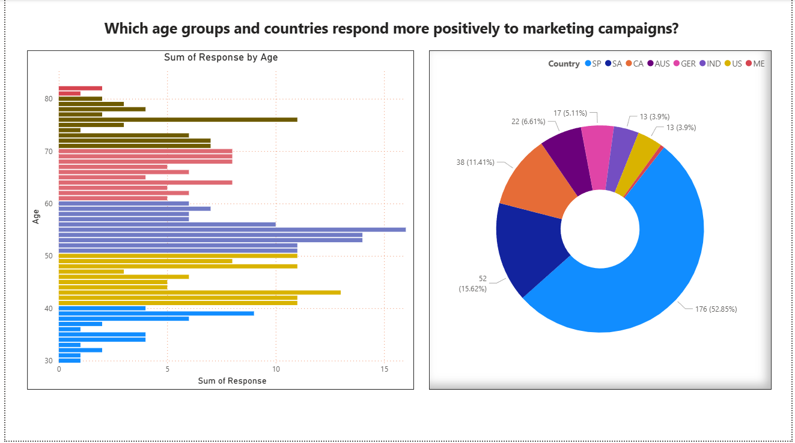
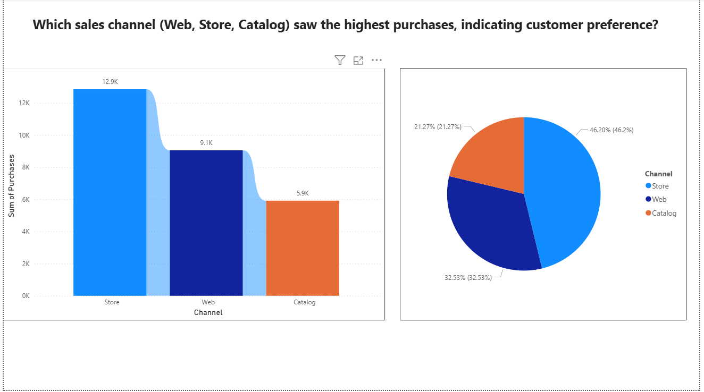
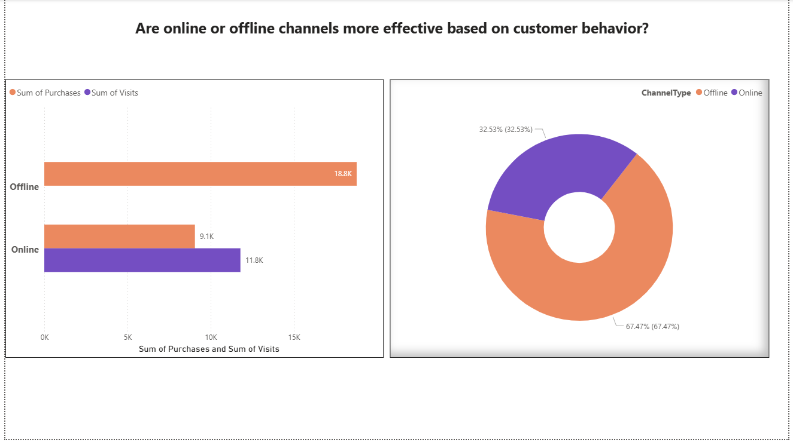

# 📊 Marketing Campaign Dashboard (Task 02)

An interactive Power BI dashboard to analyze and optimize social media campaign performance, customer behavior, and marketing ROI.  
Built as part of **Data Science & Analytics Internship Task 02 by Future Interns**.

---

## 🧭 Project Overview

This dashboard helps answer critical marketing questions:
- Which campaigns performed best?
- What customer segments are most responsive?
- What channels drive the most purchases?
- How has engagement and customer acquisition evolved?

🛠 Tools Used:
- Power BI (DAX, Power Query)
- Excel (for data cleaning)
- Canva (optional visuals)
- GitHub (project hosting)

---

## 📈 Dashboard Features

| Insight Area                | Description |
|----------------------------|-------------|
| 🎯 Campaign Performance     | Analyze campaign response rates and ROI |
| 👤 Customer Demographics    | Age groups, marital status, education |
| 🛍️ Channel Preference       | Web, Catalog, Store purchases |
| 📅 Trend Over Time          | Customer acquisition and response trends |
| 🧠 KPI Cards                | Total Customers, Avg. Campaign Acceptance, Avg. Customer Spend, Recent Inactivity, etc. |

---

## 📸 Screenshots

| Report Page | Screenshot |
|-------------|------------|
| Overview    |  |
| Campaigns   |  |
| Segments    |  |
| Channels    |  |
| Time Trend  |  |
| Mode        |  |

---

## 🧠 Key Insights

> From [`docs/insights_report.md`](docs/insights_report.md)

- ✅ **Campaign 3 & 4** had the highest acceptance rate.
- 🧑‍🤝‍🧑 **Age 40–60** was the most responsive group.
- 🌐 **Store** was the dominant purchase channel.
- 📈 Customer signups spiked after Campaign 4.
- 💡 Use customer segmentation to personalize future ads.

---

## 📄 How to Use This Dashboard

> See [`docs/how_to_use.md`](docs/how_to_use.md) for full steps.

1. Open `pbix/Marketing_Dashboard.pbix` in Power BI Desktop.
2. Navigate through pages using report tabs.
3. Use slicers to filter by age, channel, campaign, etc.
4. Explore KPI cards and visuals to identify patterns.

---

## 🧮 KPIs Tracked

> From [`docs/kpi_definitions.md`](docs/kpi_definitions.md)

| KPI                        | DAX Formula (Summary)                           |
|---------------------------|-------------------------------------------------|
| Total Customers           | `COUNTROWS(CustomerTable)`                     |
| Avg. Campaign Acceptance  | `AVERAGE('MarketingData'[Total_Campaigns_Accepted])` |
| Avg. Customer Spend       | `AVERAGE('MarketingData'[Total_Spend])`        |
| Recent Inactivity         | `'MarketingData'[Recency]` (days since last)   |

---

## 🚀 Project Learning Outcomes

| Concept | Learned In Task 02 |
|--------|---------------------|
| DAX Measures | Total Customers, Avg. Campaign Acceptance, Avg. Customer Spend, Recent Inactivity |
| Data Modeling | Used relationships and USERELATIONSHIP |
| Visual Design | Created clean, insightful Power BI report |
| Storytelling | Connected data to business outcomes |
| GitHub Workflow | Documented & structured the entire project |

---

## 📬 Contact

📧 riteshverma230465@gmail.com  
🔗 [LinkedIn](https://www.linkedin.com/in/ritesh-verma-a6054a294)  

---

## 📄 License

This project is open-source under the MIT License. Feel free to use it as a template or learning guide.
